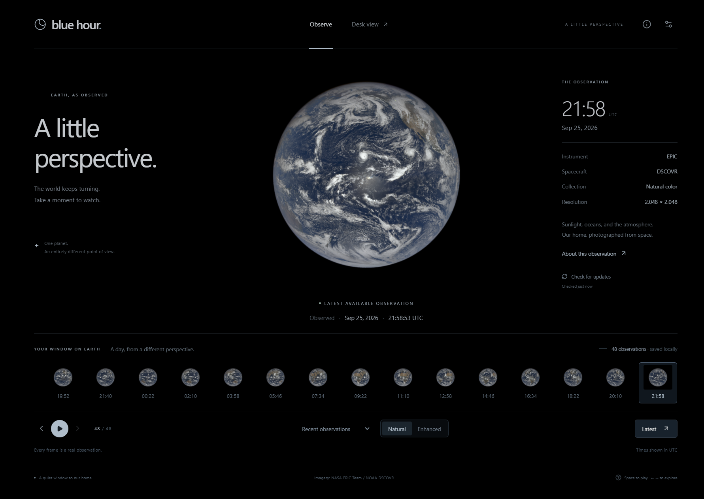

# Blue Hour

A real Earth observation on your desk. Blue Hour presents NASA EPIC photographs from NOAA's DSCOVR spacecraft in a quiet desktop observatory, with the image's actual UTC observation time.



_The running Windows app, captured with a fresh profile and the public EPIC provider. Imagery: NASA EPIC Team / NOAA DSCOVR._

## Open the app

On Windows 10 or 11, double-click **`release/Blue Hour Setup 1.0.0.exe`** to install. Open **Blue Hour** from the desktop shortcut or Start menu. No terminal, Node.js installation, account, or NASA key is required to use the public EPIC provider.

In this prepared workspace, double-click **`Launch Blue Hour.vbs`**. It opens `release/win-unpacked/Blue Hour.exe` without a console. If this workspace contains a private `.env`, the launcher passes its path to the running app; an unconfigured app reads only `NASA_API_KEY` and stores an encrypted copy in your Windows user profile. The launcher never reads the key or places its value in an argument. A key already saved through Preferences takes precedence.

The installer and unpacked executable are generated locally and are not included in the source repository. The generated installer is unsigned. Windows may identify it as an unrecognized application; a production distribution should be code-signed by its publisher.

## Use the observatory

- **Latest** returns to the newest successfully saved photograph in the chosen collection.
- **Previous / Next** explore saved observations. Their original dates and times remain visible.
- **Play** presents a recorded sequence of available photographs, without synthetic frames.
- **Natural / Enhanced** choose NASA's separate image products.
- **Daily** groups available observations by UTC date; coverage is not represented as continuous.
- **Information and settings** show source, connection status, observation age, brightness, and desktop preferences.
- **F11** enters or leaves fullscreen. **Escape** leaves fullscreen.

EPIC is a latest-available observation service, not a live webcam. The image's age and the last successful update check are separate. Saved imagery remains available when the network is unavailable.

## Private NASA configuration

The public EPIC provider works without a key. To use your own NASA credential, open **Preferences**, enter or paste it into the masked **NASA API key** field, and choose **Save API key**. The field clears after submission; a saved key is never displayed or filled back into the form. To rotate it, enter the new key and choose **Replace API key**.

You can also choose **Import .env file** and select a private `.env` file containing `NASA_API_KEY`. That native import reads the file directly in the desktop process and returns only whether configuration succeeded. Direct entry briefly holds the typed draft in interface memory while passing it through the restricted desktop bridge; it is never saved in browser storage. Closing Preferences discards an unsaved draft.

Credentials are configured at runtime. The build does not load `.env`; credentials are not embedded in JavaScript, the installer, image URLs, logs, or browser storage. A saved or imported key is encrypted with Electron's OS-backed `safeStorage` and stored as `secret.bin` beneath `%APPDATA%\Blue Hour`. On Windows this uses DPAPI tied to your Windows account. An existing saved key takes precedence over launcher configuration when the app restarts, so replacing it in Preferences persists. Keep your original `.env` private and untracked. See [SECURITY.md](SECURITY.md).

Selecting the public provider or the NASA API provider is an explicit setting. A failed authenticated request does not silently switch providers.

## Architecture

| Layer                 | Responsibility                                                                                                |
| --------------------- | ------------------------------------------------------------------------------------------------------------- |
| `src/`                | React interface, observation navigation, recorded playback, accessibility and presentation settings           |
| `shared/contracts.ts` | Versionable data and desktop bridge contracts; no secrets                                                     |
| `server/`             | NASA adapters, validated image downloads, SQLite metadata, bounded disk cache, and loopback-only HTTP service |
| `electron/`           | Native Windows lifecycle, restricted preload bridge, private configuration and optional login startup         |
| `scripts/`            | Deterministic builds, icon generation and privacy verification                                                |
| `tests/`              | Data, cache, API, privacy and interaction checks                                                              |

The renderer receives sanitized metadata and local image URLs from one loopback origin. It has no Node.js access. Native actions are exposed through individual IPC methods with sender checks. All permissions, downloads, webviews and external navigation are blocked. Only the backend contacts NASA.

Application data lives under `%APPDATA%\Blue Hour`, outside the project and installer: encrypted credential, non-secret native preferences, and the image cache. Removing the application does not erase saved observations or private settings automatically.

## Development and release maintenance

These commands are for contributors; end users use the executable or installer above. Use the pinned dependency versions and Node.js 24 or later.

```powershell
npm.cmd ci
npm.cmd run typecheck
npm.cmd test
npm.cmd run build
npm.cmd run verify:privacy
node scripts/verify-desktop.mjs
node scripts/smoke-desktop.mjs
node scripts/smoke-key-entry.mjs
npm.cmd start
```

`npm run package` creates the Windows x64 installer and unpacked application in `release/`. `npm run package:dir` creates only the unpacked application. A release should be tested from its installed shortcut on a clean Windows user profile, including a saved-image offline restart. Release signing and automatic updates are not configured.

The source-tree `.env` is a development/runtime input only. Vite environment loading is disabled and installer contents are explicitly allowlisted. Never add a real credential to examples, test fixtures, screenshots, issue reports or release archives.

To refresh the README image after building the app, run `node scripts/capture-readme.mjs`. It opens an isolated, credential-free desktop profile, downloads public NASA imagery, and captures only the observatory. It never opens your saved profile or key-entry form.

## Scope and verification

See [the verification record](docs/verification.md) for tested behavior and remaining hardware-stage work.

This is the desktop implementation of the supplied Blue Hour blueprint. A circular display can be previewed on the desktop, but physical readability, touch size, panel brightness, thermal behavior, enclosure design, power-loss recovery and a 24-hour hardware soak still require a selected display and computer. The brightness preference dims the interface while preserving the source photograph; it does not control a physical panel backlight.

No freely rotatable synthetic globe, generated observation imagery, inferred reverse side, account system, advertising, analytics or remote crash reporting is included. Geometry overlays and curated archive events are deferred until their source data and projections are validated.

**Imagery: NASA EPIC Team / NOAA DSCOVR.** [EPIC documentation](https://epic.gsfc.nasa.gov/about/api) · [NASA EPIC image information and credits](https://epic.gsfc.nasa.gov/about)
